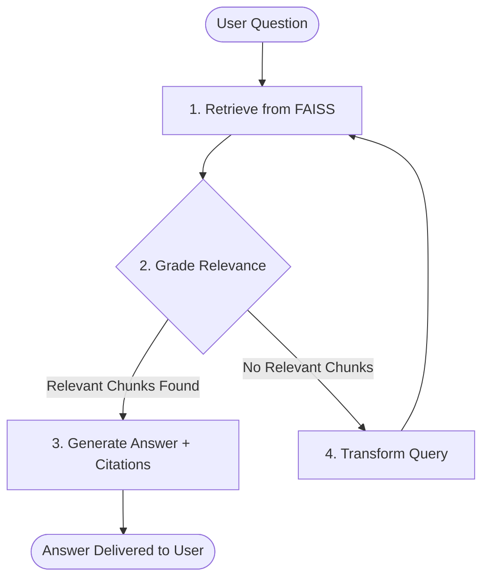

# 🧠 LangGraph RAG Assistant with FAISS & OpenRouter

A high-performance **Retrieval-Augmented Generation (RAG)** application built with **LangGraph**, **FAISS Vector Database**, and **OpenRouter API** (OpenAI-compatible models).

---

## 🌟 Key Features

- **LangGraph Workflow**: Implements a robust stateful graph (`Retrieve` ➔ `Grade Documents` ➔ `Transform Query (if needed)` ➔ `Generate Answer`).
- **Multi-Format Document Support**: Drag-and-drop ingestion for **PDF** (`.pdf`), **Word** (`.docx`), **Text** (`.txt`), **Markdown** (`.md`), and **CSV** (`.csv`).
- **FAISS Vector Store**: Fast local similarity search with disk persistence.
- **OpenRouter Powered**: Use any LLM (e.g. `openai/gpt-4o-mini`, `anthropic/claude-3.5-sonnet`, `deepseek/deepseek-chat`, `google/gemini-2.0-flash-001`, `meta-llama/llama-3.3-70b-instruct`) and OpenAI-compatible embeddings.
- **Modern Interactive UI**: Streamlit web interface with real-time indexing progress, live LangGraph execution trace, and source citation inspector.
- **Interactive CLI**: Query or batch-index documents directly from your terminal.

---

## 📋 What You Have To Do (Quick Start Guide)

Follow these simple steps to run the application:

### Step 1: Get Your OpenRouter API Key
1. Go to [https://openrouter.ai/keys](https://openrouter.ai/keys).
2. Sign up / log in and create a new API key (starts with `sk-or-v1-...`).

### Step 2: Configure Environment (Optional but Recommended)
Copy `.env.example` to `.env` and paste your OpenRouter API key:
```bash
cp .env.example .env
```
Open `.env` and fill in:
```ini
OPENROUTER_API_KEY=sk-or-v1-your-actual-key-here
```
*(Alternatively, you can also paste your API key directly into the Streamlit Web UI sidebar at runtime).*

### Step 3: Install Dependencies
If not already installed, run:
```bash
pip install -r requirements.txt
```
*(Or activate the included virtual environment: `.\venv\Scripts\activate` on Windows).*

### Step 4: Run the Streamlit Web Application
Launch the web interface by running:
```bash
streamlit run app.py
```
*(Or using the venv directly: `.\venv\Scripts\streamlit run app.py`)*

The browser will open at `http://localhost:8501`.

### Step 5: Upload Documents & Ask Questions
1. In the web interface, expand **"Upload & Index Documents"**.
2. Drag and drop your PDFs, Word documents, or text files.
3. Click **"🚀 Process & Index to FAISS"**.
4. Once indexed, type your question in the chat input at the bottom and hit Enter!
5. View the answer along with the **LangGraph Execution Trace** and **Source References**.

---

## 🖥️ Command Line (CLI) Usage

You can also use the CLI without opening a browser:

### Interactive Terminal Mode:
```bash
python main.py
```

### Batch Index Files via CLI:
```bash
python main.py --index path/to/document.pdf path/to/notes.txt
```

### Ask a Single Question via CLI:
```bash
python main.py --query "What are the main findings in the document?"
```

---

## 🏗️ LangGraph Architecture



---

## 📁 Project Structure

```
├── app.py              # Modern Streamlit Web Application
├── rag_graph.py        # LangGraph StateGraph & nodes (Retrieve, Grade, Transform, Generate)
├── vectorstore.py      # Multi-format document loader & FAISS vector store manager
├── config.py           # Configuration loader & OpenRouter client factory
├── main.py             # CLI runner for indexing and terminal Q&A
├── requirements.txt    # Project dependencies
├── .env.example        # Environment variables template
└── README.md           # Documentation & user guide
```
